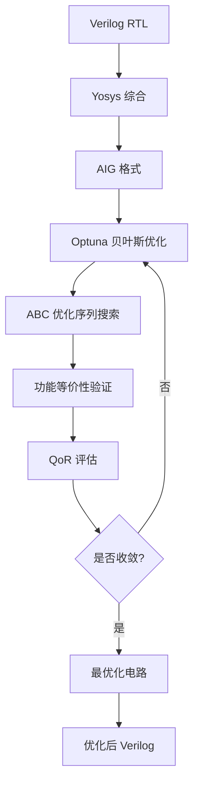

# Verilog Logic Optimizer - 基于贝叶斯优化的数字逻辑优化工具

## 🎯 项目概述

本项目是一个基于**贝叶斯优化**的 Verilog RTL 逻辑优化工具，能够自动搜索最优的 ABC 优化序列来最小化电路的面积和延迟。通过结合现代机器学习优化技术与传统 EDA 工具，实现智能化的数字电路优化。

### 核心特性

- 🔬 **智能优化**：使用 Optuna TPE 采样器进行贝叶斯优化搜索
- ⚡ **工具链集成**：无缝集成 Yosys 和 ABC 工具
- 🎛️ **灵活配置**：支持自定义优化目标权重和搜索参数  
- 🔍 **功能验证**：通过组合等价性检查确保优化正确性
- 📊 **结果可视化**：提供详细的优化过程和结果统计

## 🏗️ 技术方案

### 整体架构



### 核心算法流程

#### 1. RTL 到 AIG 转换
```bash
# Yosys 综合流程
read_verilog input.v
hierarchy -check -top module_name  
synth -flatten -noabc
opt; clean; aigmap; opt; clean
write_aiger output.aig
```

#### 2. 贝叶斯优化搜索
- **目标函数**: `cost = cells + delay_weight × levels`
- **搜索空间**: ABC 优化命令序列组合
- **采样策略**: Tree-structured Parzen Estimator (TPE)
- **约束条件**: 功能等价性必须保持

#### 3. ABC 优化序列
支持的优化命令包括：
- `balance` - 平衡 AIG 结构
- `rewrite` / `rewrite -z` - 重写逻辑结构  
- `resub` / `resub -K 6` - 重新替换
- `dc2` - 不关心条件优化
- `dch` - 选择函数优化
- `resyn2` - 综合优化组合

### 优化目标

**质量评估函数 (QoR)**:
```python
QoR = AND_gates + delay_weight × logic_levels
```

- **AND_gates**: AIG 中 AND 门的数量（面积代价）
- **logic_levels**: 逻辑层数（延迟代价）  
- **delay_weight**: 延迟权重系数（默认 0.1）

## 🛠️ 环境部署

### 系统要求
- **操作系统**: Ubuntu 22.04+ (推荐)
- **Python**: 3.8+
- **内存**: 至少 4GB RAM
- **磁盘**: 1GB+ 可用空间

### 依赖工具安装

#### 1. 基础工具链
```bash
# 更新包管理器
sudo apt update && sudo apt upgrade -y

# 安装基础开发工具
sudo apt install -y git build-essential python3-venv \
    yosys verilator libreadline-dev libncurses5-dev \
    cmake ninja-build
```

#### 2. ABC 工具安装
```bash
# 从源码编译 ABC (获得最新功能)
git clone https://github.com/berkeley-abc/abc.git
cd abc
make -j$(nproc)
sudo cp abc /usr/local/bin/
cd ..

# 验证安装
abc -q "version"
```

#### 3. Python 环境配置
```bash
# 创建虚拟环境
python3 -m venv venv
source venv/bin/activate

# 安装 Python 依赖
pip install --upgrade pip
pip install optuna matplotlib pandas numpy
```

### 工具验证
```bash
# 验证 Yosys
yosys -V

# 验证 ABC  
abc -q "version"

# 验证 Python 包
python -c "import optuna; print(f'Optuna {optuna.__version__} installed')"
```

## 🚀 使用指南

### 基本用法

#### 1. 使用内置示例
```bash
# 激活 Python 环境
source venv/bin/activate

# 运行内置组合逻辑示例
python3 vop.py
```

#### 2. 优化自定义 Verilog 文件
```bash
# 基本用法
python3 vop.py my_design.v --top top_module

# 指定优化参数
python3 vop.py my_design.v --top top_module \
    --n-trials 100 \        # 优化试验次数
    --seq-len 8 \           # 优化序列长度  
    --delay-w 0.2 \         # 延迟权重
    --out-dir results       # 输出目录
```

### 命令行参数详解

| 参数 | 默认值 | 说明 |
|------|--------|------|
| `verilog` | 内置示例 | 输入 Verilog 文件路径 |
| `--top` | 自动检测 | 顶层模块名称 |
| `-n, --n-trials` | 60 | 贝叶斯优化试验次数 |
| `-l, --seq-len` | 6 | ABC 优化序列最大长度 |
| `-w, --delay-w` | 0.1 | 延迟权重系数 |
| `-o, --out-dir` | bo_out | 输出目录路径 |

### 输出文件说明

优化完成后，在输出目录中会生成：

```
bo_out/
├── golden.aig          # 原始 AIG 文件
├── best.aig           # 最优化后的 AIG  
└── best_opt.v         # 最优化后的 Verilog
```

## 📊 使用示例

### 示例 1: 简单组合逻辑优化

```verilog
// example_adder.v
module simple_adder (
    input  [7:0] a, b, c,
    output [7:0] sum,
    output [7:0] product_low
);
    assign sum = a + b + c;
    assign product_low = (a * b) & 8'hFF;
endmodule
```

```bash
python3 vop.py example_adder.v --top simple_adder -n 50
```

### 示例 2: 复杂逻辑优化

```bash
# 对复杂设计进行深度优化
python3 vop.py complex_design.v --top cpu_core \
    --n-trials 200 \
    --seq-len 10 \
    --delay-w 0.3 \
    --out-dir complex_results
```

### 典型输出示例

```
[+] ABC version: UC Berkeley, ABC 1.01
[+] Yosys: RTL → AIG …
[+] Optuna search: trials=60, seq_len=6
[DEBUG] ABC stats output: i/o =     16/    8  and =     45  lev =      4
100%|████████████████████| 60/60 [00:15<00:00,  3.87it/s]

★ Best cost : 49.4
★ Best seq  : balance; rewrite; resub -K 6; dc2
[✓] Optimised Verilog: bo_out/best_opt.v
```

## 🔧 高级功能

### 自定义优化策略

#### 1. 修改搜索空间
编辑 `vop.py` 中的 `PASS_CANDIDATES`:
```python
PASS_CANDIDATES = [
    "",  # 空操作
    "balance", "rewrite", "rewrite -z",
    "resub", "resub -K 6", "resub -K 8",  # 增加更大的 K 值
    "dc2", "dch", "resyn2", "resyn3",     # 添加新的优化命令
    "lutpack",  # LUT 优化 (适用于 FPGA)
]
```

#### 2. 调整目标函数
```python
# 更重视面积优化
return cells + 0.05 * levels  

# 更重视延迟优化  
return cells + 0.5 * levels

# 包含其他指标
return cells + delay_weight * levels + 0.01 * inputs
```

### 批量处理脚本

```bash
#!/bin/bash
# batch_optimize.sh
designs=("design1.v" "design2.v" "design3.v")
tops=("cpu" "dsp" "memory")

for i in "${!designs[@]}"; do
    echo "优化 ${designs[$i]}..."
    python3 vop.py "${designs[$i]}" --top "${tops[$i]}" \
        --n-trials 100 --out-dir "results_${tops[$i]}"
done
```

## 🐛 故障排除

### 常见问题及解决方案

#### 1. ABC 未找到
```
✗ ABC not found or not working
```
**解决方案**: 重新安装 ABC 或检查 PATH 环境变量
```bash
which abc
sudo ln -s /path/to/abc /usr/local/bin/abc
```

#### 2. Yosys AIG 转换失败  
```
ERROR: Unsupported cell type: $_DFF_PN0_
```
**原因**: 输入 Verilog 包含时序逻辑，但 AIG 只支持组合逻辑  
**解决方案**: 确保输入为纯组合逻辑，或修改综合脚本

#### 3. 所有优化试验失败
```
✗ All optimization trials failed!
```
**排查步骤**:
1. 检查 ABC 版本兼容性
2. 验证 AIG 文件格式正确性
3. 尝试更简单的优化序列
4. 检查 ABC 命令语法

#### 4. 内存不足
**解决方案**: 减少并行试验数量或增加系统内存
```bash
python3 vop.py design.v --n-trials 30  # 减少试验次数
```

### 调试技巧

#### 1. 启用详细输出
```python
# 在 sh() 函数中添加调试
def sh(cmd: str, timeout: int = ABC_TIMEOUT) -> str:
    print(f"[DEBUG] Running: {cmd}")  # 添加此行
    proc = subprocess.run(...)
```

#### 2. 检查中间文件
```bash
# 查看生成的 AIG 文件
abc -q "read bo_out/golden.aig; ps"

# 检查 Verilog 语法
yosys -p "read_verilog input.v; hierarchy"
```

## 📈 性能优化建议

### 1. 硬件配置
- **CPU**: 多核处理器 (Optuna 支持并行化)
- **内存**: 8GB+ (处理大型设计)
- **存储**: SSD (加速文件 I/O)

### 2. 算法参数调优
- **试验次数**: 从 50 开始，复杂设计可增至 200+
- **序列长度**: 6-8 通常效果较好
- **延迟权重**: 根据设计目标调整 (0.05-0.5)

### 3. 搜索策略优化
```python
# 使用更先进的采样器
sampler = optuna.samplers.CmaEsSampler()  # 进化策略
# 或
sampler = optuna.samplers.TPESampler(multivariate=True)  # 多变量 TPE
```

## 🔬 扩展开发

### 1. 添加新的优化目标
```python
def evaluate_power(golden: Path, seq: List[str]) -> float:
    """基于功耗的评估函数"""
    # 集成功耗分析工具
    power = get_power_estimation(optimized_circuit)
    return power

def multi_objective_evaluate(golden: Path, seq: List[str]) -> tuple:
    """多目标优化"""
    area = get_area(seq)
    delay = get_delay(seq) 
    power = get_power(seq)
    return (area, delay, power)
```

### 2. 支持更多 EDA 工具
```python
def synopsys_optimize(rtl: str, constraints: str) -> str:
    """集成 Synopsys Design Compiler"""
    # 实现 DC 综合流程
    pass

def vivado_optimize(rtl: str, target_fpga: str) -> str:
    """集成 Xilinx Vivado"""
    # 实现 Vivado 综合流程  
    pass
```

### 3. 机器学习增强
```python
import torch
import torch.nn as nn

class SequencePredictor(nn.Module):
    """基于历史数据预测最优序列"""
    def __init__(self):
        super().__init__()
        # 定义神经网络结构
        
    def predict_sequence(self, design_features):
        # 预测最优起始序列
        pass
```

## 📚 参考资料

### 相关论文
1. Bergstra, J. & Bengio, Y. "Random Search for Hyper-Parameter Optimization" (2012)
2. Akiba, T. et al. "Optuna: A Next-generation Hyperparameter Optimization Framework" (2019)
3. Mishchenko, A. & Brayton, R. "SAT-based complete don't-care computation for network optimization" (2005)

### 工具文档
- [Yosys Manual](http://www.clifford.at/yosys/documentation.html)
- [ABC Documentation](https://people.eecs.berkeley.edu/~alanmi/abc/)
- [Optuna Documentation](https://optuna.readthedocs.io/)

### 开源项目
- [Berkeley ABC](https://github.com/berkeley-abc/abc)
- [YosysHQ/yosys](https://github.com/YosysHQ/yosys)
- [Optuna](https://github.com/optuna/optuna)

## 📝 版本历史

### v1.0 (当前版本)
- ✅ 基础贝叶斯优化框架
- ✅ Yosys + ABC 工具链集成
- ✅ 命令行界面
- ✅ 错误处理和调试功能

### 计划功能 (v1.1+)
- 🔄 多目标优化支持
- 🔄 时序逻辑优化
- 🔄 GUI 界面
- 🔄 分布式优化支持

## 🤝 贡献指南

欢迎贡献代码！请遵循以下步骤：

1. Fork 项目仓库
2. 创建功能分支: `git checkout -b feature/amazing-feature`
3. 提交更改: `git commit -m 'Add amazing feature'`
4. 推送分支: `git push origin feature/amazing-feature`  
5. 提交 Pull Request

## 📄 许可证

本项目采用 MIT 许可证 - 详见 [LICENSE](LICENSE) 文件

## ✉️ 联系方式

如有问题或建议，请通过以下方式联系：
- 📧 Email: your.email@example.com
- 🐛 Issues: [GitHub Issues](https://github.com/your-repo/issues)
- 💬 Discussions: [GitHub Discussions](https://github.com/your-repo/discussions)

---
*该项目旨在推进开源 EDA 工具的发展，欢迎学术界和工业界的朋友们参与贡献！* 